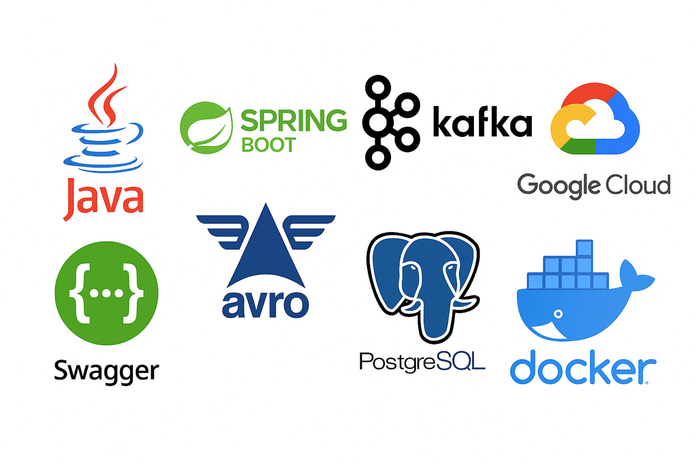

# flashsale-purchase-processor

## Overview

`flashsale-purchase-processor` is a Spring Boot microservice responsible for consuming and processing purchase requests from a Kafka topic in an event-driven Flash Sale architecture.

This service demonstrates:
- Event-driven architecture patterns
- Kafka consumer implementation using Spring Kafka
- Message processing with idempotency
- Error handling & retry mechanisms
- Observability (structured logging, metrics)
- Clean code architecture & separation of concerns

---

## Architecture Context

// TODO

---

## Responsibilities

This microservice is responsible for:
- Consuming purchase request events from Kafka topic `flashsale.purchase.requests`
- Validating message structure and content
- Ensuring idempotent processing of requests (avoiding duplicates)
- Persisting processed purchases to the database
- Emitting follow-up events (optional, e.g., order created)
- Handling transient errors with retries and dead-letter queue fallback

---

## Kafka Topic Consumed

| Topic                               | Purpose                                        |
|------------------------------------|------------------------------------------------|
| `flashsale.purchase.requests`     | Incoming purchase requests to be processed    |

## Avro Schema of Consumed Messages

```json
{
  "type": "record",
  "name": "PurchaseRequest",
  "namespace": "ch.luimode.flashsale",
  "fields": [
    { "name": "purchaseId", "type": "string" },
    { "name": "userId", "type": "string" },
    { "name": "itemId", "type": "string" },
    { "name": "quantity", "type": "int" },
    { "name": "requestedAt", "type": { "type": "long", "logicalType": "timestamp-millis" } },
    { "name": "source", "type": { "type": "enum", "name": "SourceType", "symbols": ["WEB", "MOBILE", "API"] } }
  ]
}
```

---

## Used Technologies
* ☕ Java 17 
* 🌱 Spring Boot 3.x
* ☁︎ Confluent Cloud, Spring Kafka
* 𝓐 Apache Avro (Schema Registry Integration)
* 🔀 Kafka Client
* 🏝 Lombok
* 🐘 PostgreSQL
* 🚢 Testcontainers (integration testing)
* 🐳 Docker / Docker Compose



---

## Running the Application

```bash
./mvnw spring-boot:run
```

### Running tests
```bash
./mvnw test
```

---

## Purpose of the Project

This microservice is part of a larger showcase system demonstrating:
* A robust and scalable event-driven architectures
* Kafka-first design
* Resilience under load spikes (typical in flash sales)
* Scalable Kubernetes deployment
* Observability best practices
* Infrastructure as Code (Terraform-managed Kafka resources)